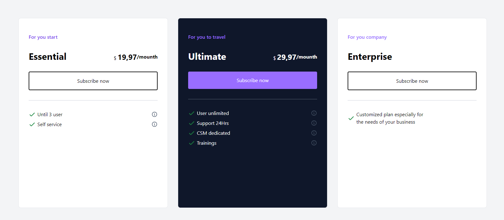

<h1 align="center">Pricing Table</h1>
<p align="center">
  
  
  
</p>
<p align="center">
    
</p>

<br>
<br>

## 🧪 Technologies

This project was developed using the following technologies:

- [NodeJS](https://nodejs.org/)
- [ViteJS](https://vitejs.dev/)
- [ReactJS](https://reactjs.org/)
- [TailwindCSS](https://tailwindcss.com/)


## 🚀 Getting started
Clone the project and access the folder.

```bash
$ https://github.com/weslleyolli/pricing-table
$ cd pricing-table
```

Follow the steps below:

### Web

```bash
# Install the web dependencies
$ cd web
$ npm install

# Start the web project
$ npm run dev
```

---

Made with 💜 by [Weslleyolli](https://github.com/weslleyolli)👋